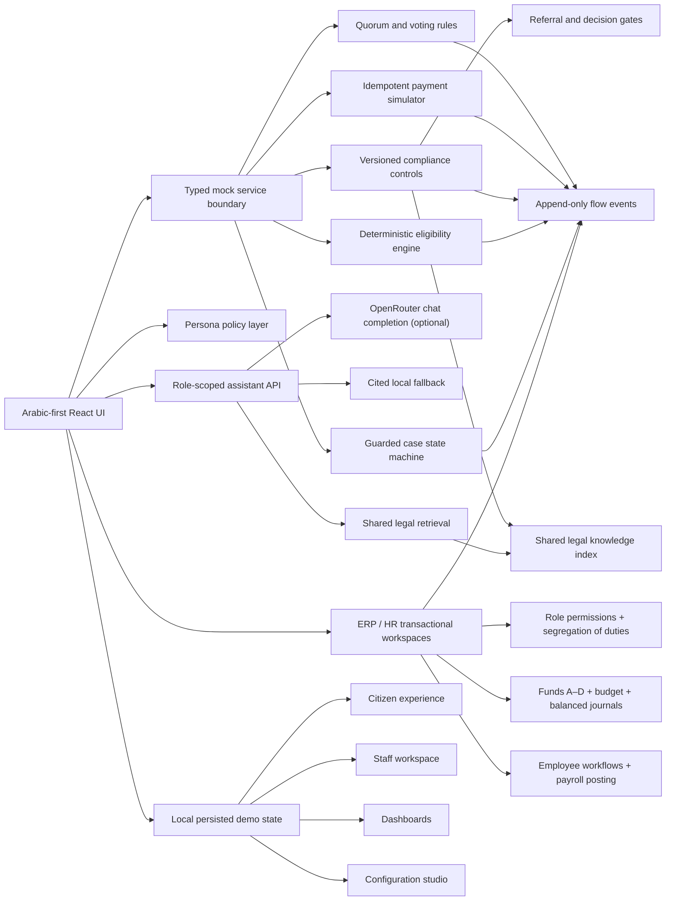

# POC Architecture

## Domain boundaries

- `lib/types.ts`: shared domain contracts.
- `lib/seed.ts`: connected synthetic records and configuration.
- `lib/domain.ts`: pure workflow, rule, payment, quorum, and policy behavior.
- `lib/enterprise.ts`: 35-module ERP/HR catalogue, nine operational roles, SoD, budget and idempotency controls, balanced posting, tasks, and transitions.
- `lib/compliance.ts`: legal index, 18 controls, deterministic evaluation, and blocking policy.
- `lib/legal-assistant.ts`: 27 source-indexed legal chunks, Arabic normalization, lexical retrieval, case-context formatting, LLM guardrails, and cited fallback answers.
- `app/api/legal-assistant/route.ts`: server-only OpenRouter integration, input limits, timeout, history trimming, guardrails, and retrieval fallback.
- `app/enterprise-operations.tsx`: role workspaces, task inboxes, and the reusable transactional list/detail/form/action/history screen contract.
- The same enterprise domain powers a locked employee self-service surface under `/staff/erp`; it exposes only personal HR/administrative records and employee-originated requests while approvals remain in manager and specialist queues.
- `app/legal-assistant-ui.tsx`: shared multi-turn experience for citizen and staff scopes.
- `app/compliance-ui.tsx`: compliance dashboard, case control workbench, and assistant route wrappers.
- `app/platform.tsx`: route-aware application composition and interactive screens.
- `app/globals.css`: independent visual system, RTL, responsive, accessibility, and print behavior.

## State and data flow

The browser loads deterministic initial state, hydrates it from D1, and keeps a device-local fallback. UI actions call guarded domain functions, update the shared case or enterprise state, append an audit event, and create notifications. ERP/HR records, tasks, funds, budget lines and workflow histories therefore survive reloads in the POC. Before referral and committee signature, the same compliance engine evaluates the same legal/control versions and blocks unresolved mandatory results.

The assistant sends only role-authorized synthetic case context to the server route. Retrieval always runs first against the shared source index. When `OPENROUTER_API_KEY` exists, retrieved passages and case context are sent to the pinned model with strict citation and no-decision instructions. When it does not exist or times out, the same passages produce a deterministic cited answer.

## Production replacement path

- Replace local persistence with authenticated APIs and a transactional case store.
- Replace the POC document-state ERP/HR store with normalized ledgers, subledgers, HR schemas, server-side authorization, database transactions, locks, period controls and immutable accounting/audit stores.
- Replace the in-process state machine with a versioned workflow service.
- Store append-only events in a governed audit/event platform.
- Load service, form, rule, notification, and workflow versions from a configuration service.
- Replace adapters behind vendor-neutral interfaces for identity, education, payment, messaging, banking, and signature.
- Replace the POC lexical retriever with an approved hybrid/vector index, evaluation suite, governed prompts and models, privacy review, retention policy, and production-grade audit persistence.
